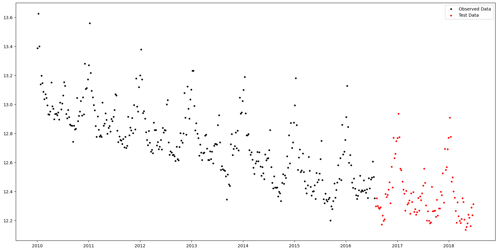
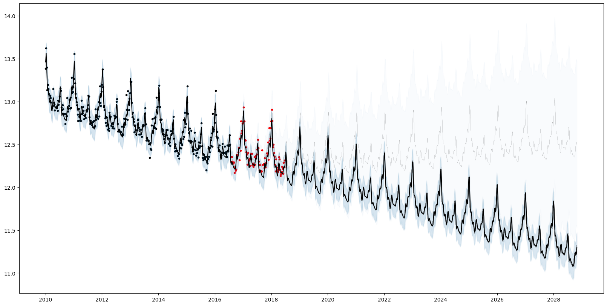
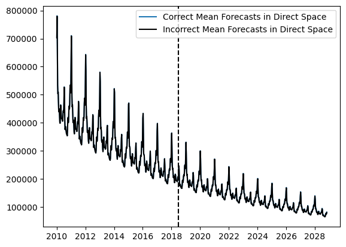
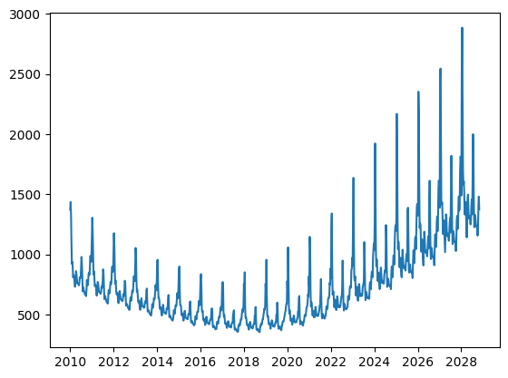

<!--
Copyright 2023 Google LLC

Licensed under the Apache License, Version 2.0 (the "License");
you may not use this file except in compliance with the License.
You may obtain a copy of the License at

     http://www.apache.org/licenses/LICENSE-2.0

Unless required by applicable law or agreed to in writing, software
distributed under the License is distributed on an "AS IS" BASIS,
WITHOUT WARRANTIES OR CONDITIONS OF ANY KIND, either express or implied.
See the License for the specific language governing permissions and
limitations under the License.
-->

# Insurance Claims

This tutorial uses AutoGP to discover time series models of weekly insurance claims data.


```julia
import AutoGP
import CSV
import Dates
import DataFrames

using PyPlot: plt
```

We first load the [`iclaims.csv`](assets/iclaims.csv) dataset from disk.  Since the data is positive we apply a log transform and perform all modeling in this transformed space.


```julia
data = CSV.File("assets/iclaims.csv"; header=[:ds, :y], types=Dict(:ds=>Dates.Date, :y=>Float64));
df = DataFrames.DataFrame(data)
df[:,"y"] = log.(df[:,"y"])
show(df)
```

         │ ds          y
    ─────┼─────────────────────
       1 │ 2010-01-03  13.3866
       2 │ 2010-01-10  13.6242
       3 │ 2010-01-17  13.3987
       4 │ 2010-01-24  13.1375
       5 │ 2010-01-31  13.1968
       6 │ 2010-02-07  13.147
       7 │ 2010-02-14  13.0859
       8 │ 2010-02-21  13.035
       9 │ 2010-02-28  13.0704
      10 │ 2010-03-07  13.0448
      11 │ 2010-03-14  12.9924
      12 │ 2010-03-21  12.9314
      ⋮  │     ⋮          ⋮
     433 │ 2018-04-15  12.3287
     434 │ 2018-04-22  12.2068
     435 │ 2018-04-29  12.1359
     436 │ 2018-05-06  12.1562
     437 │ 2018-05-13  12.1819
     438 │ 2018-05-20  12.2407
     439 │ 2018-05-27  12.2202
     440 │ 2018-06-03  12.1628
     441 │ 2018-06-10  12.289
     442 │ 2018-06-17  12.2357
     443 │ 2018-06-24  12.3139
               420 rows omitted

Let's hold out the final 100 weeks of observations to serve as test data.


```julia
n_test = 100
n_train = DataFrames.nrow(df) - n_test
df_train = df[1:end-n_test, :]
df_test = df[end-n_test+1:end, :]

fig, ax = plt.subplots()
ax.scatter(df_train.ds, df_train.y, marker=".", color="k", label="Observed Data")
ax.scatter(df_test.ds, df_test.y, marker=".", color="r", label="Test Data")
ax.legend()

fig.set_size_inches((20, 10))
```


    

    


The next step is to initialize an [`AutoGP.GPModel`](@ref) instance and fit the model using sequential Monte Carlo structure learning.


```julia
model = AutoGP.GPModel(df_train.ds, df_train.y; n_particles=8);
```


```julia
AutoGP.seed!(10)
schedule = AutoGP.Schedule.linear_schedule(n_train, .20)
AutoGP.fit_smc!(model; schedule=schedule, n_mcmc=50, n_hmc=10, shuffle=true, adaptive_resampling=false, verbose=true);
```

    Running SMC round 69/343
    weights [3.38e-32, 4.11e-20, 7.26e-29, 1.02e-44, 4.74e-57, 9.10e-04, 9.99e-01, 2.71e-17]
    resampled true
    accepted MCMC[4/50] HMC[40/40]
    accepted MCMC[6/50] HMC[48/50]
    accepted MCMC[7/50] HMC[61/63]
    accepted MCMC[9/50] HMC[73/77]
    accepted MCMC[8/50] HMC[62/64]
    accepted MCMC[7/50] HMC[68/69]
    accepted MCMC[12/50] HMC[92/97]
    accepted MCMC[14/50] HMC[114/118]
    Running SMC round 138/343
    weights [1.10e-01, 1.39e-01, 1.98e-01, 1.71e-01, 1.66e-01, 1.78e-01, 1.80e-02, 2.08e-02]
    resampled true
    accepted MCMC[2/50] HMC[3/5]
    accepted MCMC[3/50] HMC[15/17]
    accepted MCMC[13/50] HMC[0/13]
    accepted MCMC[15/50] HMC[0/15]
    accepted MCMC[8/50] HMC[17/24]
    accepted MCMC[8/50] HMC[12/20]
    accepted MCMC[12/50] HMC[20/32]
    accepted MCMC[16/50] HMC[62/73]
    Running SMC round 207/343
    weights [1.21e-18, 1.72e-18, 1.00e+00, 3.00e-20, 1.48e-12, 2.59e-17, 8.86e-18, 1.49e-17]
    resampled true
    accepted MCMC[8/50] HMC[0/8]
    accepted MCMC[10/50] HMC[0/10]
    accepted MCMC[10/50] HMC[0/10]
    accepted MCMC[12/50] HMC[0/12]
    accepted MCMC[11/50] HMC[0/11]
    accepted MCMC[12/50] HMC[0/12]
    accepted MCMC[13/50] HMC[0/13]
    accepted MCMC[16/50] HMC[2/18]
    Running SMC round 276/343
    weights [1.52e-01, 1.63e-04, 1.51e-01, 4.79e-01, 1.04e-01, 9.47e-02, 1.76e-02, 1.36e-03]
    resampled true
    accepted MCMC[7/50] HMC[0/7]
    accepted MCMC[12/50] HMC[0/12]
    accepted MCMC[11/50] HMC[0/11]
    accepted MCMC[12/50] HMC[0/12]
    accepted MCMC[11/50] HMC[1/12]
    accepted MCMC[13/50] HMC[1/14]
    accepted MCMC[19/50] HMC[0/19]
    accepted MCMC[20/50] HMC[0/20]
    Running SMC round 343/343
    weights [4.25e-03, 3.87e-04, 5.39e-03, 5.37e-03, 2.16e-04, 5.35e-01, 4.40e-01, 9.31e-03]
    accepted MCMC[10/50] HMC[0/10]
    accepted MCMC[10/50] HMC[0/10]
    accepted MCMC[12/50] HMC[0/12]
    accepted MCMC[13/50] HMC[1/14]
    accepted MCMC[14/50] HMC[0/14]
    accepted MCMC[16/50] HMC[0/16]
    accepted MCMC[17/50] HMC[0/17]
    accepted MCMC[14/50] HMC[1/15]


Plotting the forecasts from each particle reflects the structural uncertainty.  7/8 particles have inferred a periodic component ([`AutoGP.GP.Periodic`](@ref)) with additive linear trend [`AutoGP.GP.Linear`](@ref). 1/8 of the particles has inferred a sum of a periodic kernel and gamma exponential ([`AutoGP.GP.GammaExponential`](@ref)) kernel, which is stationary but not "smooth" (formally, not mean-square differentiable).


```julia
# Generate in-sample and future predictions.
ds_future = range(start=df_test.ds[end]+Dates.Week(1), step=Dates.Week(1), length=54*10)
ds_query = vcat(df_train.ds, df_test.ds, ds_future)
forecasts = AutoGP.predict(model, ds_query; quantiles=[0.025, 0.975]);
weights = AutoGP.particle_weights(model)

# Plot the data.
fig, ax = plt.subplots()
ax.scatter(df_train.ds, df_train.y, marker=".", color="k", label="Observed Data")
ax.scatter(df_test.ds, df_test.y, marker=".", color="r", label="Test Data")

# Plot the forecasts from each particle.
for i=1:AutoGP.num_particles(model)
    subdf = forecasts[forecasts.particle.==i,:]
    ax.plot(subdf[!,"ds"], subdf[!,"y_mean"], color="k", linewidth=.1)
    ax.fill_between(
        subdf.ds, subdf[!,"y_0.025"], subdf[!,"y_0.975"];
        color="tab:blue", alpha=0.025)
end

# Plot the grand mean.
mvn = AutoGP.predict_mvn(model, ds_query)
ax.plot(ds_query, AutoGP.Distributions.mean(mvn), color="k");

fig.set_size_inches((20, 10))
```


    

    


```julia
for (w, k) in zip(AutoGP.particle_weights(model), AutoGP.covariance_kernels(model))
    println("Particle weight $(w)")
    display(k)
end
```

    Particle weight 0.004250523793423254


    ＋
    ├── LIN(0.43; 0.06, 0.40)
    └── PER(0.27, 0.15; 0.12)


    Particle weight 0.0003867955857232888


    ＋
    ├── LIN(0.21; 0.48, 0.28)
    └── PER(0.31, 0.15; 0.14)


    Particle weight 0.0053919770385446346


    ＋
    ├── PER(0.27, 0.15; 0.12)
    └── LIN(0.10; 0.11, 1.58)


    Particle weight 0.005373167226504197


    ＋
    ├── LIN(0.55; 0.04, 0.06)
    └── PER(0.27, 0.15; 0.12)


    Particle weight 0.0002161576411907359


    ＋
    ├── LIN(0.45; 0.05, 0.18)
    └── PER(0.27, 0.15; 0.12)


    Particle weight 0.5354267607568092


    ＋
    ├── PER(0.27, 0.15; 0.12)
    └── LIN(0.22; 0.19, 0.18)


    Particle weight 0.43964210411237775


    ＋
    ├── LIN(0.09; 0.12, 0.11)
    └── PER(0.23, 0.15; 0.11)


    Particle weight 0.009312513845423434


    ＋
    ├── GE(1.72, 1.66; 0.13)
    └── PER(0.29, 0.15; 0.12)


!!! note

    Mean forecasts, quantile forecasts, and probability densities values obtained via [`AutoGP.predict`](@ref) and [`AutoGP.predict_proba`](@ref) are all in the transformed (log space).  Only quantile forecasts can be transformed back to direct space via `exp`.  Converting mean forecasts and probability densities can be performed by using the [`Distributions.MvLogNormal`](https://juliastats.org/Distributions.jl/stable/multivariate/#Distributions.MvLogNormal) constructor, as demonstrated below.


```julia
import Distributions
log_mvn_components = [Distributions.MvLogNormal(d) for d in Distributions.components(mvn)]
log_mvn_weights = Distributions.probs(mvn)
log_mvn = Distributions.MixtureModel(log_mvn_components, log_mvn_weights);
```


```julia
fig, ax = plt.subplots()
ax.plot(ds_query, Distributions.mean(log_mvn), color="tab:blue", label="Correct Mean Forecasts in Direct Space")
ax.plot(ds_query, exp.(Distributions.mean(mvn)), color="k", label="Incorrect Mean Forecasts in Direct Space")
ax.axvline(df_test.ds[end], color="k", linestyle="--")
ax.legend()
```


    

    


    PyObject <matplotlib.legend.Legend object at 0x7f3598672c80>


The difference between the blue and black curves is too small to observe on the scale above; let us plot the bias that arises from doing a naive transformation.


```julia
fig, ax = plt.subplots()
ax.plot(ds_query, Distributions.mean(log_mvn) - exp.(Distributions.mean(mvn)));
```


    

    

