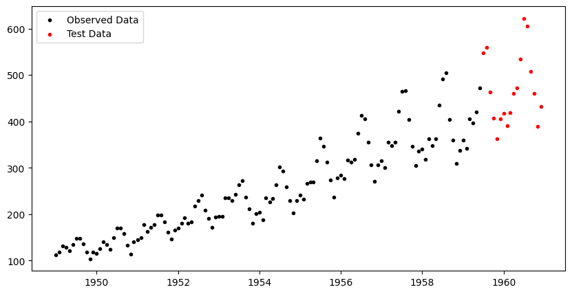
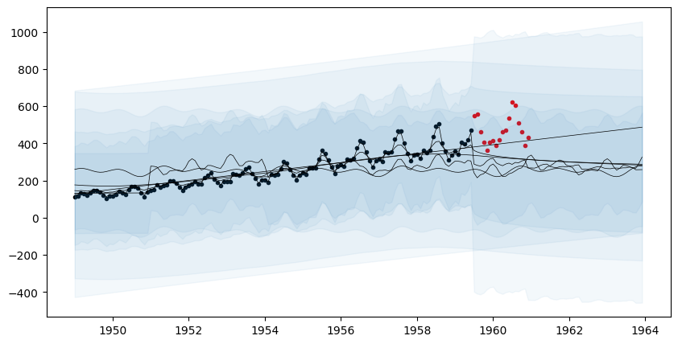
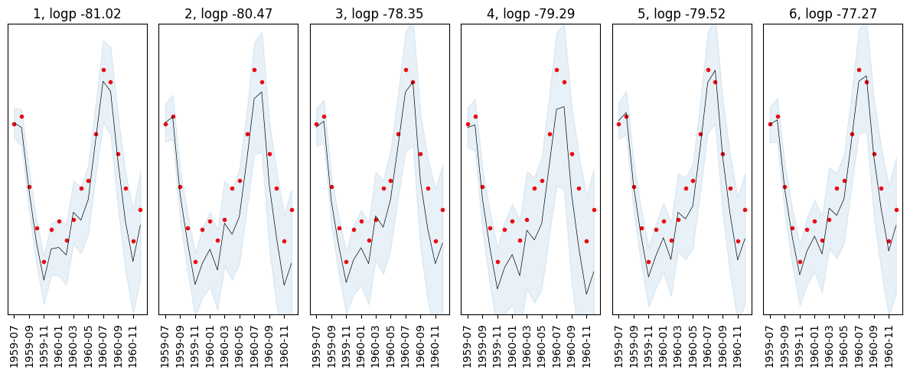

<!--
Copyright 2023 Google LLC

Licensed under the Apache License, Version 2.0 (the "License");
you may not use this file except in compliance with the License.
You may obtain a copy of the License at

     http://www.apache.org/licenses/LICENSE-2.0

Unless required by applicable law or agreed to in writing, software
distributed under the License is distributed on an "AS IS" BASIS,
WITHOUT WARRANTIES OR CONDITIONS OF ANY KIND, either express or implied.
See the License for the specific language governing permissions and
limitations under the License.
-->

# Overview

This tutorial demonstrates the basic capabilities of the [`AutoGP`](@ref) package.


```julia
import AutoGP
```


```julia
import CSV
import Dates
import DataFrames

using PyPlot: plt
```

## Loading Data

The first step is to load a dataset from disk. The [`tsdl.161.csv`](assets/tsdl.161.csv) file, obtained from the [Time Series Data Library](https://pkg.yangzhuoranyang.com/tsdl/), has two columns:

- `ds` indicates time stamps.
- `y` indicates measured time series values.

In the call to `CSV.File`, we explicitly set the type of the `ds` column to `Dates.Date`, permitted types for time indexes are types `T <: Real` and `T < :Dates.TimeType`, see [`AutoGP.IndexType`](@ref).


```julia
data = CSV.File("assets/tsdl.161.csv"; header=[:ds, :y], types=Dict(:ds=>Dates.Date, :y=>Float64));
df = DataFrames.DataFrame(data)
show(df)
```

         │ ds          y
    ─────┼───────────────────
       1 │ 1949-01-01  112.0
       2 │ 1949-02-01  118.0
       3 │ 1949-03-01  132.0
       4 │ 1949-04-01  129.0
       5 │ 1949-05-01  121.0
       6 │ 1949-06-01  135.0
       7 │ 1949-07-01  148.0
       8 │ 1949-08-01  148.0
       9 │ 1949-09-01  136.0
      10 │ 1949-10-01  119.0
      11 │ 1949-11-01  104.0
      12 │ 1949-12-01  118.0
      ⋮  │     ⋮         ⋮
     134 │ 1960-02-01  391.0
     135 │ 1960-03-01  419.0
     136 │ 1960-04-01  461.0
     137 │ 1960-05-01  472.0
     138 │ 1960-06-01  535.0
     139 │ 1960-07-01  622.0
     140 │ 1960-08-01  606.0
     141 │ 1960-09-01  508.0
     142 │ 1960-10-01  461.0
     143 │ 1960-11-01  390.0
     144 │ 1960-12-01  432.0
             121 rows omitted

We next split the data into a training set and test set.


```julia
n_test = 18
n_train = DataFrames.nrow(df) - n_test
df_train = df[1:end-n_test, :]
df_test = df[end-n_test+1:end, :]

fig, ax = plt.subplots(figsize=(10,5))
ax.scatter(df_train.ds, df_train.y, marker=".", color="k", label="Observed Data")
ax.scatter(df_test.ds, df_test.y, marker=".", color="r", label="Test Data")
ax.legend();
```


    

    


## Creating an AutoGP Model

Julia natively supports multiprocessing, which greatly improves performance for embarrassingly parallel computations in `AutoGP`. The number of threads available to Julia can be set using the `JULIA_NUM_THREADS=[nthreads]` environment variable or invoking `julia -t [nthreads]` from the command line.


```julia
Threads.nthreads()
```


    8


We next initialize a [`AutoGP.GPModel`](@ref), which will enable us to automatically discover an ensemble of [Gaussian process covariance kernels](@ref gp_cov_kernel) for modeling the time series data. Initially, the model structures and parameters are sampled from the prior.  The `n_particles` argument is optional and specifices the number of particles for [sequential Monte Carlo inference](#Fitting-the-Model-using-Sequential-Monte-Carlo).


```julia
model = AutoGP.GPModel(df_train.ds, df_train.y; n_particles=6);
```

## Generating Prior Forecasts

Calling [`AutoGP.covariance_kernels`](@ref) returns the ensemble of covariance kernel structures and parameters, whose weights are given by [`AutoGP.particle_weights`](@ref). These model structures have not yet been fitted to the data, so we are essentially importance sampling the posterior over structures and parameters given data by using the prior distribution as the proposal.


```julia
weights = AutoGP.particle_weights(model)
kernels = AutoGP.covariance_kernels(model)
for (i, (k, w)) in enumerate(zip(kernels, weights))
    println("Model $(i), Weight $(w)")
    Base.display(k)
end
```

    Model 1, Weight 0.26142074394894477


    CP(0.19055667126219877, 0.001)
    ├── LIN(1.26; 3.19, 0.06)
    └── PER(0.11, 0.52; 0.13)


    Model 2, Weight 4.0257929388061755e-27


    LIN(0.09; 0.52, 0.20)


    Model 3, Weight 1.7975106803349286e-9


    PER(1.37, 0.30; 1.04)


    Model 4, Weight 1.1645819463329054e-21


    GE(0.42, 1.00; 0.04)


    Model 5, Weight 7.24814391228416e-39


    ×
    ├── GE(0.09, 0.54; 1.82)
    └── PER(0.18, 0.14; 0.42)


    Model 6, Weight 0.7385792542535452


    GE(0.13, 0.29; 0.11)


Forecasts are obtained using [`AutoGP.predict`](@ref), which takes in a `model`, a list of time points `ds` (which we specify to be the observed time points, the test time points, and 36 months of future time points). We also specify a list of `quantiles` for obtaining prediction intervals. The return value is a [`DataFrames.DataFrame`](https://dataframes.juliadata.org/stable/lib/types/#DataFrames.DataFrame) object that show the particle id, particle weight, and predictions from each of the particles in `model`.


```julia
ds_future = range(start=df.ds[end]+Dates.Month(1), step=Dates.Month(1), length=36)
ds_query = vcat(df_train.ds, df_test.ds, ds_future)
forecasts = AutoGP.predict(model, ds_query; quantiles=[0.025, 0.975])
show(forecasts)
```

          │ ds          particle  weight    y_0.025   y_0.975  y_mean
    ──────┼────────────────────────────────────────────────────────────
        1 │ 1949-01-01         1  0.261421  -83.3461  347.688  132.171
        2 │ 1949-02-01         1  0.261421  -83.1647  347.645  132.24
        3 │ 1949-03-01         1  0.261421  -83.0097  347.615  132.303
        4 │ 1949-04-01         1  0.261421  -82.8478  347.592  132.372
        5 │ 1949-05-01         1  0.261421  -82.7009  347.579  132.439
        6 │ 1949-06-01         1  0.261421  -82.5592  347.576  132.508
        7 │ 1949-07-01         1  0.261421  -82.4319  347.583  132.575
        8 │ 1949-08-01         1  0.261421  -82.3105  347.6    132.645
        9 │ 1949-09-01         1  0.261421  -82.1993  347.627  132.714
       10 │ 1949-10-01         1  0.261421  -82.1016  347.664  132.781
       11 │ 1949-11-01         1  0.261421  -82.0108  347.711  132.85
       12 │ 1949-12-01         1  0.261421  -81.9328  347.767  132.917
      ⋮   │     ⋮          ⋮         ⋮         ⋮         ⋮        ⋮
     1070 │ 1963-02-01         6  0.738579  -71.2452  656.635  292.695
     1071 │ 1963-03-01         6  0.738579  -71.8672  656.291  292.212
     1072 │ 1963-04-01         6  0.738579  -72.5386  655.92   291.691
     1073 │ 1963-05-01         6  0.738579  -73.1719  655.57   291.199
     1074 │ 1963-06-01         6  0.738579  -73.8099  655.217  290.703
     1075 │ 1963-07-01         6  0.738579  -74.4122  654.883  290.235
     1076 │ 1963-08-01         6  0.738579  -75.0194  654.546  289.763
     1077 │ 1963-09-01         6  0.738579  -75.6119  654.218  289.303
     1078 │ 1963-10-01         6  0.738579  -76.1718  653.907  288.868
     1079 │ 1963-11-01         6  0.738579  -76.7368  653.594  288.428
     1080 │ 1963-12-01         6  0.738579  -77.2711  653.297  288.013
                                                      1057 rows omitted

Let us visualize the forecasts before model fitting. The model clearly underfits the data.


```julia
fig, ax = plt.subplots(figsize=(10,5))

ax.scatter(df_train.ds, df_train.y, marker=".", color="k", label="Observed Data")
ax.scatter(df_test.ds, df_test.y, marker=".", color="r", label="Test Data")

for i=1:AutoGP.num_particles(model)
    subdf = forecasts[forecasts.particle.==i,:]
    ax.plot(subdf[!,"ds"], subdf[!,"y_mean"], color="k", linewidth=.5)
    ax.fill_between(
        subdf.ds, subdf[!,"y_0.025"], subdf[!,"y_0.975"];
        color="tab:blue", alpha=0.05)
end
```


    

    


## Model Fitting via SMC

The next step is to fit the model to the observed data. There are [three fitting algorithms](@ref end_to_end_model_fitting) available.  We will use [`AutoGP.fit_smc!`](@ref) which leverages sequential Monte Carlo structure learning to infer the covariance kernel structures and parameters.

The annealing schedule below adds roughly 10% of the observed data at each step, with 100 MCMC rejuvenation steps over the structure and 10 Hamiltonian Monte Carlo steps for the parameters. Using `verbose=true` will print some statistics about the acceptance rates of difference MCMC and HMC moves that are performed within the SMC learning algorithm.


```julia
AutoGP.seed!(6)
AutoGP.fit_smc!(model, AutoGP.Schedule.linear_schedule(n_train, .10), 75, 10; verbose=true);
```

    Running SMC round 13/126
    weights [2.14e-01, 5.85e-02, 2.05e-01, 5.23e-01, 1.09e-04, 1.51e-04]
    resampled true
    accepted MCMC[12/75] HMC[71/78]
    accepted MCMC[9/75] HMC[64/69]
    accepted MCMC[19/75] HMC[122/132]
    accepted MCMC[22/75] HMC[121/136]
    accepted MCMC[22/75] HMC[89/107]
    accepted MCMC[27/75] HMC[191/202]
    Running SMC round 26/126
    weights [8.08e-03, 4.24e-01, 1.10e-03, 1.92e-02, 3.97e-01, 1.50e-01]
    resampled true
    accepted MCMC[7/75] HMC[55/58]
    accepted MCMC[6/75] HMC[37/40]
    accepted MCMC[6/75] HMC[43/47]
    accepted MCMC[12/75] HMC[52/60]
    accepted MCMC[18/75] HMC[84/97]
    accepted MCMC[21/75] HMC[112/125]
    Running SMC round 39/126
    weights [1.99e-02, 1.74e-01, 3.01e-02, 4.08e-02, 1.95e-02, 7.16e-01]
    resampled true
    accepted MCMC[0/75] HMC[0/0]
    accepted MCMC[1/75] HMC[6/7]
    accepted MCMC[5/75] HMC[43/44]
    accepted MCMC[13/75] HMC[50/61]
    accepted MCMC[10/75] HMC[64/71]
    accepted MCMC[17/75] HMC[95/105]
    Running SMC round 52/126
    weights [1.66e-03, 8.13e-02, 8.69e-02, 1.65e-01, 4.54e-02, 6.20e-01]
    resampled true
    accepted MCMC[3/75] HMC[24/25]
    accepted MCMC[4/75] HMC[24/27]
    accepted MCMC[11/75] HMC[25/36]
    accepted MCMC[17/75] HMC[111/122]
    accepted MCMC[23/75] HMC[62/84]
    accepted MCMC[24/75] HMC[92/114]
    Running SMC round 65/126
    weights [3.87e-02, 5.07e-01, 7.59e-03, 1.50e-01, 5.29e-02, 2.44e-01]
    resampled true
    accepted MCMC[0/75] HMC[0/0]
    accepted MCMC[18/75] HMC[7/25]
    accepted MCMC[20/75] HMC[11/31]
    accepted MCMC[28/75] HMC[27/55]
    accepted MCMC[26/75] HMC[25/51]
    accepted MCMC[27/75] HMC[35/62]
    Running SMC round 78/126
    weights [5.42e-06, 2.46e-04, 1.94e-04, 3.56e-04, 9.42e-01, 5.75e-02]
    resampled true
    accepted MCMC[14/75] HMC[0/14]
    accepted MCMC[14/75] HMC[0/14]
    accepted MCMC[17/75] HMC[0/17]
    accepted MCMC[15/75] HMC[2/17]
    accepted MCMC[26/75] HMC[2/28]
    accepted MCMC[18/75] HMC[0/18]
    Running SMC round 91/126
    weights [5.03e-02, 1.90e-04, 3.17e-01, 9.72e-02, 1.74e-01, 3.61e-01]
    resampled false
    accepted MCMC[16/75] HMC[0/16]
    accepted MCMC[15/75] HMC[0/15]
    accepted MCMC[12/75] HMC[0/12]
    accepted MCMC[16/75] HMC[0/16]
    accepted MCMC[18/75] HMC[0/18]
    accepted MCMC[28/75] HMC[1/29]
    Running SMC round 104/126
    weights [1.14e-02, 6.30e-08, 7.42e-02, 6.76e-01, 1.48e-01, 9.09e-02]
    resampled true
    accepted MCMC[15/75] HMC[0/15]
    accepted MCMC[14/75] HMC[0/14]
    accepted MCMC[12/75] HMC[0/12]
    accepted MCMC[16/75] HMC[0/16]
    accepted MCMC[15/75] HMC[1/16]
    accepted MCMC[30/75] HMC[0/30]
    Running SMC round 117/126
    weights [3.84e-01, 4.30e-02, 2.19e-01, 1.02e-01, 1.59e-01, 9.31e-02]
    resampled false
    accepted MCMC[9/75] HMC[0/9]
    accepted MCMC[15/75] HMC[0/15]
    accepted MCMC[20/75] HMC[1/21]
    accepted MCMC[15/75] HMC[0/15]
    accepted MCMC[17/75] HMC[0/17]
    accepted MCMC[20/75] HMC[0/20]
    Running SMC round 126/126
    weights [5.19e-01, 3.88e-02, 5.85e-02, 1.22e-01, 9.97e-02, 1.62e-01]
    accepted MCMC[10/75] HMC[0/10]
    accepted MCMC[15/75] HMC[0/15]
    accepted MCMC[13/75] HMC[1/14]
    accepted MCMC[20/75] HMC[0/20]
    accepted MCMC[17/75] HMC[0/17]
    accepted MCMC[24/75] HMC[0/24]


## Generating Posterior Forecasts

Having the fit data, we can now inspect the ensemble of posterior structures, parameters, and predictions.


```julia
ds_future = range(start=df_test.ds[end]+Dates.Month(1), step=Dates.Month(1), length=36)
ds_query = vcat(df_train.ds, df_test.ds, ds_future)
forecasts = AutoGP.predict(model, ds_query; quantiles=[0.025, 0.975]);
show(forecasts)
```

          │ ds          particle  weight    y_0.025   y_0.975   y_mean
    ──────┼─────────────────────────────────────────────────────────────
        1 │ 1949-01-01         1  0.518786   95.7778   124.096  109.937
        2 │ 1949-02-01         1  0.518786  105.533    132.895  119.214
        3 │ 1949-03-01         1  0.518786  118.461    145.764  132.113
        4 │ 1949-04-01         1  0.518786  112.317    139.654  125.985
        5 │ 1949-05-01         1  0.518786  106.34     133.628  119.984
        6 │ 1949-06-01         1  0.518786  118.932    146.186  132.559
        7 │ 1949-07-01         1  0.518786  131.405    158.626  145.016
        8 │ 1949-08-01         1  0.518786  132.641    159.89   146.266
        9 │ 1949-09-01         1  0.518786  122.15     149.355  135.753
       10 │ 1949-10-01         1  0.518786  104.155    131.338  117.746
       11 │ 1949-11-01         1  0.518786   92.5327   119.705  106.119
       12 │ 1949-12-01         1  0.518786  102.479    129.31   115.894
      ⋮   │     ⋮          ⋮         ⋮         ⋮         ⋮         ⋮
     1070 │ 1963-02-01         6  0.162471  264.78     700.582  482.681
     1071 │ 1963-03-01         6  0.162471  334.241    779.225  556.733
     1072 │ 1963-04-01         6  0.162471  318.448    773.472  545.96
     1073 │ 1963-05-01         6  0.162471  345.825    809.683  577.754
     1074 │ 1963-06-01         6  0.162471  449.011    921.948  685.479
     1075 │ 1963-07-01         6  0.162471  556.444   1049.52   802.984
     1076 │ 1963-08-01         6  0.162471  576.012   1085.92   830.965
     1077 │ 1963-09-01         6  0.162471  408.099    932.331  670.215
     1078 │ 1963-10-01         6  0.162471  299.235    837.312  568.274
     1079 │ 1963-11-01         6  0.162471  216.275    768.47   492.373
     1080 │ 1963-12-01         6  0.162471  240.204    805.597  522.9
                                                       1057 rows omitted

The plot below reflects posterior uncertainty as to whether the linear componenet will persist or the data will revert to the mean.


```julia
fig, ax = plt.subplots(figsize=(10,5))
ax.scatter(df_train.ds, df_train.y, marker=".", color="k", label="Observed Data")
ax.scatter(df_test.ds, df_test.y, marker=".", color="r", label="Test Data")

for i=1:AutoGP.num_particles(model)
    subdf = forecasts[forecasts.particle.==i,:]
    ax.plot(subdf[!,"ds"], subdf[!,"y_mean"], color="k", linewidth=.5)
    ax.fill_between(
        subdf.ds, subdf[!,"y_0.025"], subdf[!,"y_0.975"];
        color="tab:blue", alpha=0.05)
end
```


    

    


We can also inspect the discovered kernel structures and their weights.


```julia
weights = AutoGP.particle_weights(model)
kernels = AutoGP.covariance_kernels(model)
for (i, (k, w)) in enumerate(zip(kernels, weights))
    println("Model $(i), Weight $(w)")
    display(k)
end
```

    Model 1, Weight 0.5187856913664618


    ＋
    ├── ×
    │   ├── LIN(0.58; 0.56, 0.19)
    │   └── ＋
    │       ├── LIN(0.19; 0.92, 0.79)
    │       └── ×
    │           ├── LIN(0.05; 0.02, 0.38)
    │           └── ＋
    │               ├── PER(0.78, 0.10; 0.20)
    │               └── GE(0.72, 1.43; 0.11)
    └── ×
        ├── LIN(0.16; 0.55, 0.51)
        └── ×
            ├── LIN(0.06; 0.16, 0.08)
            └── LIN(0.22; 0.07, 0.46)


    Model 2, Weight 0.0388018393363426


    ×
    ├── LIN(0.38; 0.08, 0.92)
    └── ＋
        ├── ×
        │   ├── LIN(0.58; 0.13, 0.07)
        │   └── GE(0.56, 1.51; 0.69)
        └── ×
            ├── LIN(0.05; 0.10, 0.70)
            └── PER(0.48, 0.10; 0.17)


    Model 3, Weight 0.05854237186951741


    ×
    ├── LIN(0.06; 0.12, 0.55)
    └── ＋
        ├── LIN(0.06; 0.83, 0.20)
        └── ×
            ├── LIN(0.05; 0.03, 0.37)
            └── ＋
                ├── PER(0.35, 0.10; 0.13)
                └── GE(0.58, 1.50; 0.20)


    Model 4, Weight 0.12171996350432317


    ×
    ├── LIN(0.07; 0.12, 0.50)
    └── ＋
        ├── ×
        │   ├── LIN(0.07; 0.08, 0.19)
        │   └── GE(0.56, 1.51; 0.69)
        └── ×
            ├── LIN(0.30; 0.13, 0.27)
            └── PER(0.48, 0.10; 0.17)


    Model 5, Weight 0.09967934632668538


    ×
    ├── LIN(0.33; 0.08, 0.84)
    └── ＋
        ├── ×
        │   ├── LIN(0.40; 0.13, 0.07)
        │   └── GE(0.69, 1.28; 0.33)
        └── ×
            ├── LIN(0.26; 0.10, 0.30)
            └── ＋
                ├── PER(0.54, 0.10; 0.14)
                └── LIN(0.52; 0.59, 0.21)


    Model 6, Weight 0.16247078759667166


    ×
    ├── LIN(0.31; 0.12, 0.32)
    └── ＋
        ├── ×
        │   ├── LIN(0.22; 0.21, 0.23)
        │   └── ＋
        │       ├── ×
        │       │   ├── LIN(0.30; 0.24, 0.92)
        │       │   └── LIN(0.10; 1.53, 0.25)
        │       └── ＋
        │           ├── GE(0.23, 1.25; 0.06)
        │           └── LIN(0.04; 0.34, 0.08)
        └── ×
            ├── LIN(0.38; 0.28, 0.27)
            └── PER(0.48, 0.10; 0.17)


## Computing Predictive Probabilities

In addition to generating forecasts, the predictive probability of new data can be computed by using [`AutoGP.predict_proba`](@ref). The table below shows that the particles in our collection are able to predict the future data with varying accuracy, illustrating the benefits of maintaining an ensemble of learned structures.


```julia
logps = AutoGP.predict_proba(model, df_test.ds, df_test.y);
show(logps)
```

       │ particle  weight     logp
    ───┼───────────────────────────────
     1 │        1  0.518786   -81.0226
     2 │        2  0.0388018  -80.4687
     3 │        3  0.0585424  -78.3537
     4 │        4  0.12172    -79.2853
     5 │        5  0.0996793  -79.5163
     6 │        6  0.162471   -77.2665

It is also possible to directly access the underlying predictive distribution of new data at arbitrary time series values by using [`AutoGP.predict_mvn`](@ref), which returns an instance of [`Distributions.MixtureModel`](https://juliastats.org/Distributions.jl/stable/mixture/#Distributions.MixtureModel). The [`Distributions.MvNormal`](https://juliastats.org/Distributions.jl/stable/multivariate/#Distributions.MvNormal) object corresponding to each of the 7 particles in the mixture can be extracted using [`Distributions.components`](https://juliastats.org/Distributions.jl/stable/mixture/#Distributions.components-Tuple{AbstractMixtureModel}) and the weights extracted using [`Distributions.probs`](https://juliastats.org/Distributions.jl/stable/mixture/#Distributions.probs-Tuple{AbstractMixtureModel}).

Each `MvNormal` in the mixture has 18 dimensions corresponding to the lenght of `df_test.ds`.


```julia
mvn = AutoGP.predict_mvn(model, df_test.ds)
```


    MixtureModel{Distributions.MvNormal}(K = 6)
    components[1] (prior = 0.5188): FullNormal(
    dim: 18
    μ: [550.0466055631144, 543.5685832436789, 458.0672732626237, 387.83042059450264, 336.3274841090669, 378.84360283044555, 380.7405954069613, 370.5597600287218, 428.60605677444596, 417.8272939610252, 445.710229207111, 527.722968622132, 606.5232420193234, 592.7113473338969, 495.58143177869687, 415.9744653512393, 361.6811541092175, 410.86491959299735]
    Σ: [110.43133996791498 70.43337927366102 … 106.0193369583544 105.68013071952048; 70.43337927366102 157.2315611083291 … 175.7899821967875 176.06414206239037; … ; 106.0193369583544 175.7899821967875 … 1289.6029024068575 1266.7465844069018; 105.68013071952048 176.06414206239037 … 1266.7465844069018 1402.6718895178888]
    )
    
    components[2] (prior = 0.0388): FullNormal(
    dim: 18
    μ: [550.0896881260433, 557.9183559988504, 451.7397701335289, 387.6936971300408, 330.34991142470057, 359.2956794851918, 378.39571104805384, 350.04141045569975, 413.64406521435524, 398.5566703647475, 422.68213778752005, 500.29404572255766, 582.8353873538858, 592.0046117753294, 465.11743221070196, 393.04897063058206, 329.267681609935, 358.99798544788507]
    Σ: [170.0085073382823 105.25012857653914 … 177.47794790860507 175.32855445033792; 105.25012857653914 238.13684073916644 … 293.4524054906246 290.979138749098; … ; 177.47794790860507 293.4524054906246 … 2416.364949433486 2381.6802393098687; 175.32855445033792 290.979138749098 … 2381.6802393098687 2639.691137455322]
    )
    
    components[3] (prior = 0.0585): FullNormal(
    dim: 18
    μ: [544.0602736685337, 552.3149196264309, 443.2068512785211, 383.4411432273028, 333.1461848874234, 363.8639799436975, 380.29770568852405, 358.75477706207874, 423.7049992204387, 408.1716555603478, 445.55695338552516, 518.8219447058625, 591.4986944066081, 605.5457079908405, 470.62796484325577, 405.9325078335371, 358.7557037493446, 386.64043978162846]
    Σ: [169.219485798796 95.5607024083134 … 186.32839433051615 187.43906631934843; 95.5607024083134 226.17368143388276 … 296.7553075541498 297.9986486627047; … ; 186.32839433051615 296.7553075541498 … 2674.2672217311588 2576.455195366638; 187.43906631934843 297.9986486627047 … 2576.455195366638 2939.5711056844825]
    )
    
    components[4] (prior = 0.1217): FullNormal(
    dim: 18
    μ: [543.6216230023799, 547.0922547835243, 446.04078249000014, 380.61770131619136, 324.29212851917504, 353.77691026184584, 371.1395407479827, 342.34364108088573, 404.0153377656334, 390.97432104186356, 413.05844950054205, 491.9302348550482, 568.3911582492668, 571.8976295358883, 452.94290011076225, 379.16919720465506, 317.0536108758739, 347.69198390460025]
    Σ: [190.70740795818799 154.7146370830134 … 264.57139974473904 263.6724500005631; 154.7146370830134 321.7637732335915 … 489.4185844326134 488.7990902096624; … ; 264.57139974473904 489.4185844326134 … 4640.723077886049 4724.747558194855; 263.6724500005631 488.7990902096624 … 4724.747558194855 5100.627801272796]
    )
    
    components[5] (prior = 0.0997): FullNormal(
    dim: 18
    μ: [552.7093727527794, 563.9629154045222, 463.17633751362314, 397.0289509923992, 340.6980456518664, 369.3109007416625, 393.9776845927133, 364.4534810210352, 428.49669476215763, 419.62843208711365, 437.11650012898417, 518.4548245910088, 604.432782069657, 621.3790060721707, 502.57788998868597, 426.35148491965776, 363.78741844671123, 392.4909178791416]
    Σ: [163.93677598232696 101.84796443535812 … 150.19871047085653 148.021181862565; 101.84796443535812 230.96594095228826 … 248.28364894831142 246.73036788677837; … ; 150.19871047085653 248.28364894831142 … 1894.8528328890138 1837.9190390714505; 148.021181862565 246.73036788677837 … 1837.9190390714505 2060.0738352212666]
    )
    
    components[6] (prior = 0.1625): FullNormal(
    dim: 18
    μ: [547.7766511058762, 554.0371551300294, 458.7231316164908, 395.94898562441665, 343.42395227426294, 375.81336956905994, 396.18401584832765, 371.80967668657166, 434.12203157338473, 424.18770474918983, 446.63575317375114, 526.406634220377, 606.4956206078521, 613.7056476449546, 502.8621955266556, 432.7728333122789, 375.92004227567435, 410.64183137650747]
    Σ: [155.68263652531186 105.08831951166466 … 153.16479636831943 151.89660431693395; 105.08831951166466 230.1409831228302 … 262.3355496966857 260.5635431735595; … ; 153.16479636831943 262.3355496966857 … 2040.7723016580135 2008.230949860343; 151.89660431693395 260.5635431735595 … 2008.230949860343 2220.8419553962394]
    )
    


Operations from the [`Distributions`](https://juliastats.org/Distributions.jl) package can now be applied to the `mvn` object.

## Incorporating New Data

Online learning is supported by using [`AutoGP.add_data!`](@ref), which lets us incorporate a new batch of observations.  Each particle's weight will be updated based on how well it predicts the new data (technically, the predictive probability it assigns to the new observations). Before adding new data, let us first look at the current particle weights.


```julia
AutoGP.particle_weights(model)
```


    6-element Vector{Float64}:
     0.5187856913664618
     0.0388018393363426
     0.05854237186951741
     0.12171996350432317
     0.09967934632668538
     0.16247078759667166


Here are the forecasts and predictive probabilities of the test data under each particle in `model`.


```julia
using Printf: @sprintf
```


```julia
forecasts = AutoGP.predict(model, df_test.ds; quantiles=[0.025, 0.975])

fig, axes = plt.subplots(ncols=6)
for i=1:AutoGP.num_particles(model)
    axes[i].scatter(df_test.ds, df_test.y, marker=".", color="r", label="Test Data")
    subdf = forecasts[forecasts.particle.==i,:]
    axes[i].plot(subdf[!,"ds"], subdf[!,"y_mean"], color="k", linewidth=.5)
    axes[i].fill_between(
        subdf.ds, subdf[!,"y_0.025"], subdf[!,"y_0.975"];
        color="tab:blue", alpha=0.1)
    axes[i].set_title("$(i), logp $(@sprintf "%1.2f" logps[i,:logp])")
    axes[i].set_yticks([])
    axes[i].set_ylim([0.8*minimum(df_test.y), 1.1*maximum(df_test.y)])
    axes[i].tick_params(axis="x", labelrotation=90)
fig.set_size_inches(12, 5)
fig.set_tight_layout(true)
end
```


    

    


Now let's incorporate the data and see what happens to the particle weights.


```julia
AutoGP.add_data!(model, df_test.ds, df_test.y)
AutoGP.particle_weights(model)
```


    6-element Vector{Float64}:
     0.054480109584894444
     0.007089917054484329
     0.08867768509766472
     0.07262818579191704
     0.04720986321304457
     0.7299142392579898


The particle weights have changed to reflect the fact that some particles are able to predict the new data better than others, which indicates they are able to better capture the underlying data generating process.
The particles can be resampled using [`AutoGP.maybe_resample!`](@ref), we will use an effective sample size of `num_particles(model)/2` as the resampling criterion.


```julia
AutoGP.maybe_resample!(model, AutoGP.num_particles(model)/2)
```


    true


Because the resampling critereon was met, the particles were resampled and now have equal weights.


```julia
AutoGP.particle_weights(model)
```


    6-element Vector{Float64}:
     0.16666666666666669
     0.16666666666666669
     0.16666666666666669
     0.16666666666666669
     0.16666666666666669
     0.16666666666666669


The estimate of the marginal likelihood can be computed using [`AutoGP.log_marginal_likelihood_estimate`](@ref).


```julia
AutoGP.log_marginal_likelihood_estimate(model)
```


    214.57030788045827


Since we have added new data, we can update the particle structures and parameters by using [`AutoGP.mcmc_structure!`](@ref). Note that this "particle rejuvenation" operation does not impact the weights. 


```julia
AutoGP.mcmc_structure!(model, 100, 10; verbose=true)
```

    accepted MCMC[19/100] HMC[0/38]
    accepted MCMC[27/100] HMC[0/54]
    accepted MCMC[23/100] HMC[0/46]
    accepted MCMC[25/100] HMC[0/50]
    accepted MCMC[26/100] HMC[0/52]
    accepted MCMC[25/100] HMC[0/50]


Let's generate and plot the forecasts over the 36 month period again now that we have observed all the data. The prediction intervals are markedly narrower and it is more likely that the linear trend will persist rather than revert.


```julia
forecasts = AutoGP.predict(model, ds_query; quantiles=[0.025, 0.975]);

fig, ax = plt.subplots(figsize=(10,5))
ax.scatter(df.ds, df.y, marker=".", color="k", label="Observed Data")
for i=1:AutoGP.num_particles(model)
    subdf = forecasts[forecasts.particle.==i,:]
    ax.plot(subdf[!,"ds"], subdf[!,"y_mean"], color="k", linewidth=.5)
    ax.fill_between(
        subdf.ds, subdf[!,"y_0.025"], subdf[!,"y_0.975"];
        color="tab:blue", alpha=0.05)
end
```


    

    

